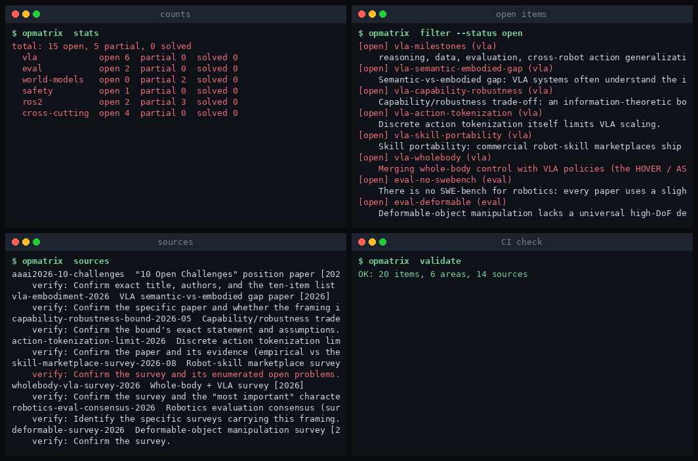
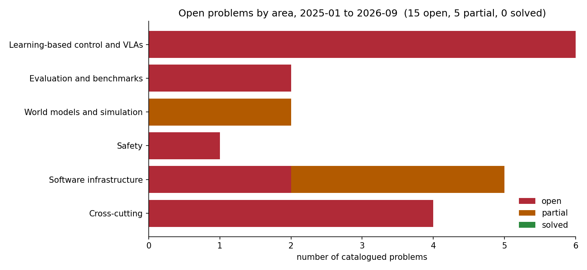
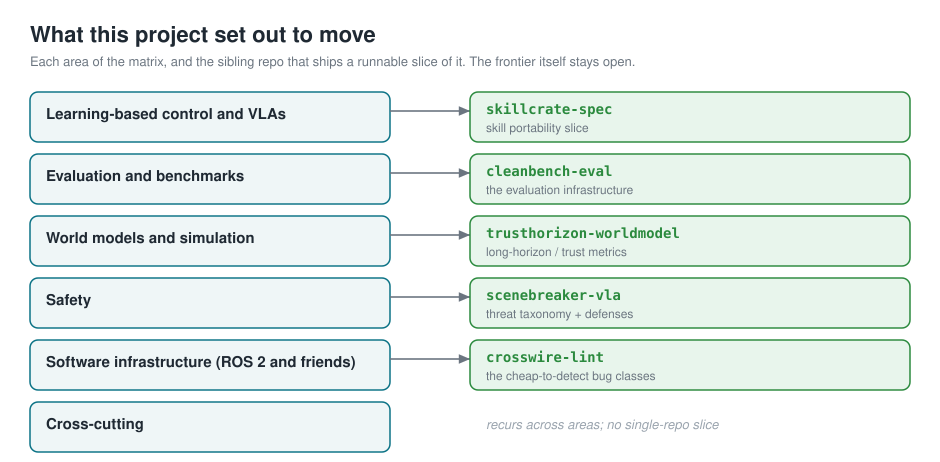

# RoboFrontier



*Four commands of the CLI.*

**A sourced, machine-checkable matrix of what is solved, partially solved, and open in embodied AI and robotics software, 2025 to September 2026.**

The 2025-2026 surveys and position papers keep restating the same open problems in prose. This repo turns that prose into structured, validated data: one row per problem, each with a status, an evidence level, a source, and a note. It renders to Markdown, JSON and a self-contained HTML page, and a CI check fails if a row cites a source that does not exist or claims a status it should not.



*Fifteen open, five partial, nothing solved. Status is the field's own, read off the cited surveys, not this repo's opinion.*

## What this is

- **Data, not an essay.** [`data/matrix.yaml`](data/matrix.yaml) holds every problem; [`data/sources.yaml`](data/sources.yaml) holds every source. The rendered matrix is [`MATRIX.md`](MATRIX.md), [`matrix.json`](matrix.json) and [`docs/matrix.html`](docs/matrix.html).
- **Honest about citations.** Sources are recorded at the granularity the seeding brief gave them (venue, year, kind), each with a `verify` note on what to confirm against the real bibliography. No arXiv IDs or author lists are invented. See [`SOURCES.md`](SOURCES.md).
- **Checkable.** `opmatrix validate` fails if any item cites a missing source, uses an illegal status, or duplicates an id. It runs in CI.

## What this is not

It does not solve any of these problems, and it does not rank them. `solved` is a status the data can carry, and right now nothing holds it, because these are open frontiers. Treat the matrix as a map, and verify each source before you cite it in academic work.

## The frontier, and where a runnable slice exists

This repo is the index for a set of sibling repositories, each of which ships a runnable slice of one area. The slice is real and bounded; the frontier stays open.



| Area | Runnable slice shipped | Repo |
|---|---|---|
| Evaluation, "no SWE-bench for robotics" | contamination-controlled, embodiment-tagged eval harness | [cleanbench-eval](https://github.com/megazron/cleanbench-eval) |
| Safety, environmental jailbreaks | threat taxonomy, defenses, attack-success-rate scoring | [scenebreaker-vla](https://github.com/megazron/scenebreaker-vla) |
| ROS 2 interaction bugs | static + live checks for units, QoS/type, config, deps | [crosswire-lint](https://github.com/megazron/crosswire-lint) |
| Skill portability | portable skill format with provenance and safety manifest | [skillcrate-spec](https://github.com/megazron/skillcrate-spec) |
| World models as sim-to-real bridges | long-horizon consistency and rollout-trust metrics | [trusthorizon-worldmodel](https://github.com/megazron/trusthorizon-worldmodel) |

## Install

```
pip install git+https://github.com/megazron/robofrontier-matrix
```

Or clone and run from source with `PYTHONPATH=src`.

## Use

```
opmatrix validate                 # check the data, exit nonzero on error (CI)
opmatrix stats                    # counts by status and area
opmatrix render --format md       # the matrix as Markdown
opmatrix render --format html -o matrix.html
opmatrix filter --status open --area vla
opmatrix sources                  # every source with its verify note
```

## The status scale

| Status | Meaning |
|---|---|
| `solved` | a broadly accepted, reproduced answer exists |
| `partial` | real progress and usable methods exist, with named gaps |
| `open` | no accepted answer; the field states this as a milestone still ahead |

`evidence_level` records the strength of the *claim behind the row*, not of the problem: `consensus` (named as a field-level open problem in a survey or position paper), `reported` (shown in individual papers), or `inferred` (a synthesis across sources, flagged as such).

## Contributing a row

Add an entry to `data/matrix.yaml` under the right area, cite a source id that exists in `data/sources.yaml` (add the source if it is new, with a `verify` note), and run `opmatrix validate`. A pull request that does not validate fails CI.

## The matrix

The full rendered matrix is in [`MATRIX.md`](MATRIX.md), regenerated from the data by `opmatrix render`.

## License

MIT, see [LICENSE](LICENSE).
